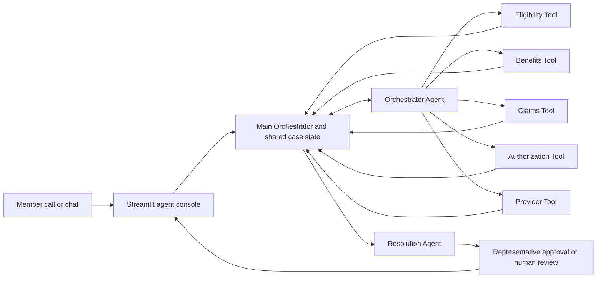

# OneCall AI

OneCall AI is a healthcare payer resolution copilot for member-service representatives. It captures a member concern once, coordinates evidence gathering across payer domains, and returns an evidence-backed next action in one guided interaction.

> One member. One representative. One resolution.

This Week 3 Agentic AI prototype uses synthetic data only. It does not provide medical advice, make clinical decisions, or perform payer-system writes.

## The problem

A single member question can span eligibility, benefits, claims, prior authorization, and provider records. Traditional servicing flows make representatives navigate those systems manually, and members may be transferred or asked to repeat the same story while each team rebuilds context.

OneCall AI addresses that operational friction by maintaining shared case state and coordinating only the checks needed to explain the issue.

## Why it matters

The prototype demonstrates how an agent-assisted servicing workflow can support:

- fewer member transfers and repeated explanations;
- faster, guided evidence collection across payer systems;
- less manual navigation and swivel-chair effort for representatives;
- more consistent investigation and resolution handling;
- human-controlled next actions with the full evidence trail attached.

No monetary savings, ROI estimates, or assumption-based business metrics are used.

## Architecture



The implementation has three clear layers:

1. **Deterministic payer tools** read synthetic eligibility, benefits, claims, authorization, and provider facts. An LLM never invents these facts.
2. **Agentic orchestration** uses an Orchestrator Agent for bounded next-step selection and a separate Resolution Agent for evidence synthesis. Enum validation, iteration limits, retry rules, and human-review boundaries constrain behavior.
3. **Streamlit console** presents intake, the one-time member explanation, the completed investigation path, supporting evidence, the recommendation, and representative approval controls.

The current front-end uses controlled playback from the same validated repository fixtures. This keeps the demo reliable and does not alter the already validated n8n workflows. A future adapter can connect the console to a live Main Orchestrator execution without changing the presentation contract.

See [Architecture and flow](docs/ARCHITECTURE_AND_FLOW.md) for component and request-flow details.

## Call-center workflow

1. The representative selects Call or Chat and a supported synthetic scenario.
2. The console prefills the validated member, service, date, and inquiry context.
3. The member concern is captured once in the intake note and retained in shared case context.
4. The orchestrated path shows intake, planning, domain checks, recovery steps, synthesis, and recommendation.
5. The final panel explains the root cause, next action, approval requirement, transfer requirement, and supporting evidence.
6. The representative approves the recommendation or escalates the complete case context to a specialist. No payer write is performed by the prototype.

## Validated scenarios

| Scenario | Demonstrated issue | Validated outcome |
|---|---|---|
| `SCN001` | Claim denied despite an approved authorization | Location mismatch; claim reconsideration |
| `SCN002` | Required authorization is actually missing | Provider initiates authorization |
| `SCN003` | Servicing coverage shows inactive despite active enrollment | Eligibility record review |
| `SCN004` | Primary authorization lookup and retry fail | Alternate lookup recovers; claim-link failure identified |

The agentic evaluation passed all four scenarios. The deterministic payer-domain suite was also validated. Detailed contracts are in [Testing and validation](docs/TESTING_AND_VALIDATION.md).

## Run the Streamlit demo

From PowerShell in the repository root:

```powershell
python -m venv .venv
.\.venv\Scripts\Activate.ps1
python -m pip install -r requirements.txt
python -m streamlit run streamlit_app.py
```

Open the local URL printed by Streamlit, normally `http://localhost:8501`.

For the strongest 3–5 minute walkthrough, use `SCN004` first to show retry and alternate authorization recovery, then briefly switch to `SCN003` to show that the orchestrator avoids unnecessary claim, authorization, and provider checks. See [Demo guide](docs/DEMO_GUIDE.md) and [Loom script](docs/LOOM_SCRIPT.md).

## Configure the optional n8n runtime

The Streamlit playback demo does not require secrets. The live n8n agentic layer does.

Create a local ignored environment file from the safe template:

```powershell
Copy-Item .env.example .env
```

Set these values locally without pasting them into source, workflow JSON, screenshots, logs, or commits:

```dotenv
NEBIUS_API_KEY=<your local key>
NEBIUS_MODEL=<available Nebius chat model>
ONECALL_DEBUG_TRACE=false
```

Then follow [Orchestrator setup](workflows/ORCHESTRATOR_SETUP.md). The repository ignores `.env` and `.streamlit/secrets.toml`; only `.env.example` is intended for source control.

## Tests and verification

Run deterministic simulator tests:

```powershell
.\.venv\Scripts\python.exe -m unittest discover -s tests -v
```

Run the validated n8n evaluation only when the local runtime is configured and an external model call is intended:

```powershell
.\scripts\verify-agentic-env.ps1
.\scripts\run-orchestrator-evaluation.ps1
```

The evaluation runs all four agentic scenarios and reports an explicit summary. Do not claim a new runtime pass unless that result is observed.

## Repository guide

| Path | Purpose |
|---|---|
| `streamlit_app.py` | Call-center console and controlled scenario playback |
| `demo/` | Deterministic simulation used by the public demo |
| `data/` | Synthetic member, benefit, claim, authorization, provider, and scenario fixtures |
| `workflows/` | Stable-ID deterministic tools and agentic n8n workflows |
| `prompts/` | Agent prompt source documentation |
| `scripts/` | Local setup, verification, evaluation, and privacy-safe tracing helpers |
| `tests/` | Deterministic simulator tests |
| `docs/` | Architecture, validation, demo, deployment, and submission documentation |

## Known limitations

- The polished Streamlit console uses validated controlled playback rather than invoking n8n live.
- All data is synthetic and covers four bounded demo scenarios.
- Recommended actions require a representative; the prototype performs no external payer writes.
- Runtime model behavior and availability depend on the locally configured Nebius account and model.
- The project demonstrates payer servicing decision support, not production authentication, authorization, audit retention, PHI controls, or clinical functionality.

## Future enhancements

- Add a typed live-runtime adapter with timeout, error, and playback fallback behavior.
- Add representative authentication, role-based access, and production audit controls.
- Expand the synthetic scenario library and formal evaluation coverage.
- Add persistent case history and approved downstream integrations.
- Measure operational outcomes only after real, governed pilot data is available.
