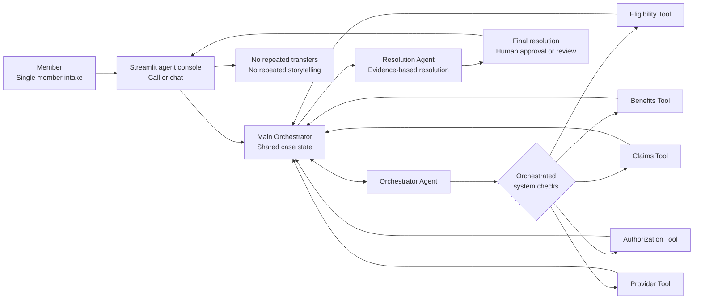
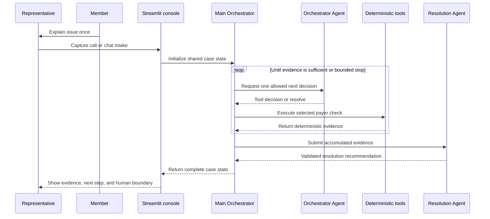

# Architecture and flow

## Design principles

OneCall AI separates payer facts, agent decisions, and human actions:

- deterministic tools own payer facts;
- agents make bounded planning and synthesis decisions;
- shared state carries evidence across the case;
- schema and enum checks reject unsafe agent output;
- a human approves any recommended payer action;
- the member inquiry is captured once and reused throughout the interaction.

## Component architecture

## Component responsibilities

| Component | Responsibility | Boundary |
|---|---|---|
| Streamlit console | Intake, architecture, progress, path, evidence, recommendation, approval UI | Controlled playback only in the current front end |
| Main Orchestrator | Shared state, bounded loop, routing, retries, recovery, terminal state | Maximum planning iterations; no payer writes |
| Orchestrator Agent | Selects exactly one allowed next decision | Uses only current case-state facts |
| Eligibility Tool | Coverage and enrollment facts | Deterministic synthetic JSON |
| Benefits Tool | Coverage rules and prior-authorization requirement | Deterministic synthetic JSON |
| Claims Tool | Claim status, denial, service, and reference facts | Deterministic synthetic JSON |
| Authorization Tool | Matching authorization status and dates | Deterministic synthetic JSON |
| Provider Tool | Provider organization, location, and network facts | Deterministic synthetic JSON |
| Resolution Agent | Root cause, explanation, next action, confidence, transfer and approval flags | Enum-validated; no tool selection or writes |
| Representative | Approves a recommendation or escalates for specialist review | Final human control point |

## Runtime request flow

## Scenario-specific routing

| Scenario | Required path characteristic |
|---|---|
| `SCN001` | Eligibility, Benefits, Claims, Authorization, and Provider evidence establish an in-network location mismatch |
| `SCN002` | Authorization returns `NOT_FOUND`; Provider is skipped because it cannot change the resolution |
| `SCN003` | Eligibility and enrollment evidence resolve the mismatch; Claims, Authorization, and Provider are avoided |
| `SCN004` | Two primary authorization failures are recorded, alternate lookup succeeds, and resolution uses the recovered evidence |

Exact live ordering is an agent decision inside the permitted decision set. The controlled Streamlit playback shows the deterministic scenario trace stored by `demo/simulator.py` and validated against `data/scenarios.json`.

## Shared case state

The state contains identifiers, inquiry context, workflow status, completed agent calls, evidence by payer domain, tool errors, retry counters, root cause, recommended action, transfer flag, approval flag, and optional privacy-safe trace metadata. See [Orchestrator state schema](ORCHESTRATOR_STATE_SCHEMA.md) for the runtime schema.

## Failure and human-handoff behavior

- Deterministic `NOT_FOUND` is treated as evidence, not a transient failure.
- `SCN004` permits one primary authorization retry, then requires the alternate route.
- Exhausted recovery, invalid model output, insufficient evidence, or the iteration guard ends in human review.
- Claim reconsideration, provider authorization initiation, and eligibility record review require representative approval.
- Neither the n8n prototype nor the Streamlit approval button performs an external payer write.

## Demo playback versus live runtime

The UI intentionally calls the local deterministic simulator. This provides a reliable submission demo, requires no secret, and uses the same supported scenario contracts. The n8n layer remains the validated reference runtime.

A future live adapter should accept the intake object and return the same presentation contract: case status, investigation path, domain evidence, root cause, recommended action, transfer flag, approval flag, and safe error information. It should use explicit timeouts and fall back to controlled playback only when the representative deliberately selects demo mode.
